# 2E FORTH OS

A Forth operating system for the Apple //e that **boots from its own sector
and talks to the disk a nibble at a time** — no DOS on the floppy and none in
memory. 290 words, an 80-column console, two graphics screens, and floating
point borrowed from the ROM.

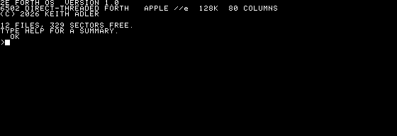

6502 source in, bootable 140K floppy out.

```bash
make roms     # rebuild the Apple ROM set from AppleWin and apple2js (once)
make gui      # boot it in a window
make test     # 400+ assertions, headless, about seven minutes
```

---

## What it does

**It decompiles itself.** `SEE` walks a word's thread and names every cell —
including the inline literal in `GREET`. `DUMP` shows memory as hex and
characters.

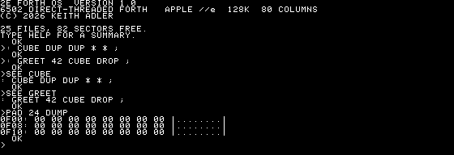

**Floating point, called rather than written.** Several kilobytes of debugged
five-byte arithmetic and transcendentals were already in the ROM, so π is four
times the arctangent of one and √2 squared comes back as exactly 2. The
language card holds the dictionary, so every call switches the ROM in and
saves the zero page Applesoft treads on.

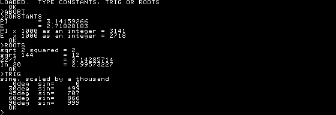

**560×192 double hi-res**, with the even byte columns in auxiliary memory.
Lines of any slope, filled and outlined shapes, circles, flood fill, bitmaps,
XOR drawing, and text on the graphics screen.

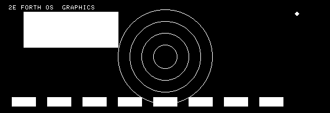

**Two fans of lines drawn in XOR**, so where a line from one crosses a line
from the other they cancel and the interference is what remains.

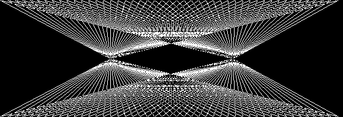

**Arcs and pie slices**, written the parametric way once `FSIN` and `FCOS`
existed — a ninety-sided polygon is a circle at this resolution.

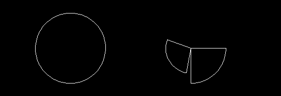

**A second screen when 560 pixels is the wrong tool.** Lo-res is the text page
seen differently — two blocks to a byte, sixteen colours, no shifting — which
is what a chart wants.

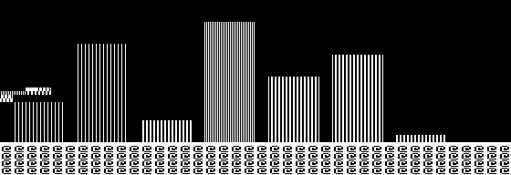

**An event queue and hit testing**, loadable from the floppy rather than
built in: a press becomes an `EV-DOWN` at the right coordinates and
`HOT-FIND` returns the execution token for whatever region it landed in.

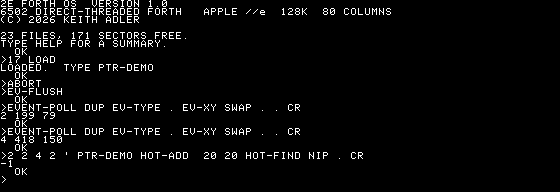

**Games, because the machine was for them.** Lunar lander with fixed-point
physics, the Breakout Woz built the hardware for, and the sombrero every
Apple II drew sooner or later — all in Forth, all on the Programs disk in
drive 2, all played from the prompt.

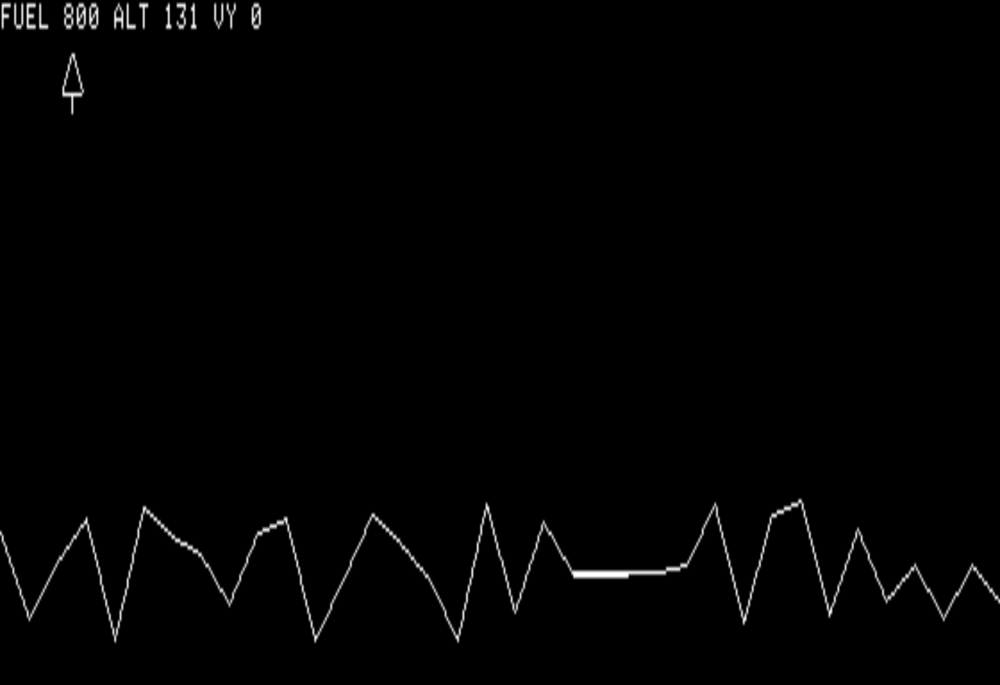

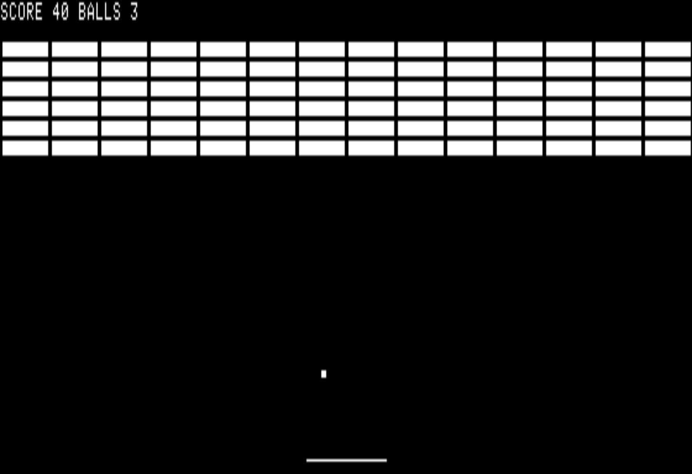

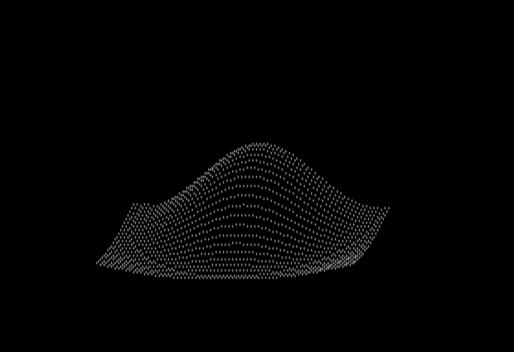

**Its own filesystem, without DOS underneath it.** `CAT` reads the catalog
through a Disk II driver written from scratch — half-track seeking, 6-and-2
decoding, address fields matched inside a 32-cycle window.

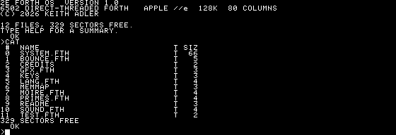

---

## How it works

A Forth system that boots to an **80-column console**, with a **560x192
monochrome double hi-res** screen and a **40x48 lo-res** one the language can
turn on when a program wants them.

| command | |
|---|---|
| `HELP HGR` | help for any word, read from a file you can edit |
| `2 DRIVE` | switch to the Programs disk — the examples and your big programs |
| `CAT` | list the disk — number, lock, name, type, size |
| `n LOAD` | compile a Forth source file off the floppy |
| `n LOCK` | lock or unlock file *n* |
| `n DEL` | delete it (refused if locked) |
| `n REN` | rename it — type the new name at the prompt |
| `WORDS` | every definition in the dictionary |
| `SEE NAME` | decompile one |
| `n LOAD` then `EHELP` | load `EDIT.FTH` and write code on the machine |
| `HELP` | a summary |

The graphics screen is a **word, not a mode you live in**: `HGR` turns it on,
the drawing words draw, `TEXT` comes back to the console.

```forth
HGR  3 HCOLOR  280 96 80 HCIRCLE  40 520 20 170 HFRAME
0 0 TAT T." DRAWN FROM THE PROMPT"
TEXT
```

**Two floppies.** The system disk boots in drive 1 with the OS, the help
file and little else; the Programs disk in drive 2 carries every example —
lunar lander, Breakout, the hat — and 350-odd free sectors for what you
build. `2 DRIVE` switches, `1 DRIVE` comes home.

**The OS writes to its own disk.** Lock, rename and delete all go through to
the image, and MAME writes it back — delete a file inside the emulator and
`a2kit catalog -d build/forth.dsk` on the host agrees it is gone. `make run`
therefore boots a scratch copy so automated runs stay reproducible; `make gui`
uses the real image, so changes you make interactively stick.

Boot takes about 31 emulated seconds, most of it compiling the system's own
Forth source (see *Boot cost* below).

## Licence

[MIT](LICENSE). Woz handed out the Apple I schematics at Homebrew and printed
the whole Monitor and Integer BASIC listings in the Red Book, so that anyone
who wanted to know how it worked could read it. He never asked for anything
back, but he did put his name on the work. MIT is that arrangement written
down.

Apple's ROMs are not covered and are not here — `make roms` rebuilds them and
verifies every CRC.

## Documentation

| | |
|---|---|
| [docs/FORTH.md](docs/FORTH.md) | what Forth is, where it came from, and which kind this is |
| [docs/TUTORIAL.md](docs/TUTORIAL.md) | from the prompt to a program saved on the floppy |
| [docs/LANGUAGE.md](docs/LANGUAGE.md) | every word, with stack effects |
| [docs/DEMOS.md](docs/DEMOS.md) | the programs on the disk, with screenshots and source |
| this file | how the machine underneath works |

## Layout

| path | what |
|---|---|
| `src/forth.s` | top level: cold start, banner, memory map |
| `src/system.fth` | **the OS written in Forth**: catalog, file commands, greeting |
| `src/dict.inc` | dictionary format and the macros that build it |
| `src/kernel.inc` | inner interpreter and the primitive word set |
| `src/interp.inc` | outer interpreter, compiler, defining words |
| `src/hires.inc` | the 560x192 double hi-res driver |
| `src/gwords.inc` | Forth bindings for the driver |
| `src/input.inc` | keyboard and game port, as Forth words |
| `src/math.inc` | 16x16 multiply, 32/16 divide, shifts, bulk memory |
| `src/compile.inc` | DOES>, the rest of the loop set, strings, FORGET |
| `src/fill.inc` | flood fill and bitmap drawing |
| `src/sound.inc` | the speaker, and the two ways to tell the time |
| `src/text.inc` | 80x24 text on the hi-res screen |
| `src/d2core.inc` | the Disk II driver: seek, read, write, 6-and-2 |
| `src/diskii.inc` | Forth bindings for it (`DREAD`, `DWRITE`) |
| `src/zp.inc` | zero page allocation |
| `examples/*.FTH` | twenty-six Forth programs — demos, tutorials, and games — put on the Programs disk by `make disk` |
| `disk/*` | the plain text files that also go on it |
| `docs/` | the language reference, tutorial, history and demo gallery |
| `test/hirestest.s` | drives the graphics driver from plain assembly, no Forth |
| `examples/hello.s` | the original 31-byte hello world, from before any of this |
| `tools/contest.py` | the console test suite — types Forth, checks machine state |
| `tools/contest.lua` | the MAME side of it: types lines at a pace the machine can keep up with, and reads the screen back |
| `tools/words.lua` | prints every name in the live dictionary |
| `tools/mkdisk.py` | lays the boot loader, kernel and source at fixed sectors, and reserves them |
| `tools/fetch-roms.py` | rebuilds the MAME ROM set from AppleWin and apple2js |
| `tools/mkfont.py` | carves a 7x8 font out of the Apple character ROM |
| `tools/mkboot.py` | converts `system.fth` into a byte table the kernel interprets |
| `tools/mkkbdrom.py` | generates the //e keyboard decoder ROM |

Everything in `src/*.s` is one assembly unit — `forth.s` includes the rest,
because the dictionary is a linked list that has to be chained in a single
pass.

## The kernel

**Direct-threaded.** A thread cell is a code field address, so the inner
interpreter ends in `JMP (W)` and a primitive costs no bytes beyond its own
machine code. A colon definition's code field is `JSR DOCOL`, which leaves
the parameter field address on the hardware stack for `DOCOL` to pick up.

**Registers.** `X` is the data stack pointer and is sacred; anything needing
`X` parks it in `XSAV` first. The data stack is 48 cells in zero page
(`$50-$AF`), addressed as `0,X`/`1,X`. The 6502 hardware stack doubles as
Forth's return stack.

**The outer interpreter is assembly**, not a colon definition. That avoids the
bootstrap problem where the thing that compiles definitions would itself need
compiling. It reaches back into Forth through `DoRun`, a two-cell thread
holding the word to run followed by a primitive that restores `IP` and
`RTS`es to the assembly caller.

310 words. `/` `MOD` `/MOD` `*/MOD` and `FM/MOD` are **floored** — the
quotient rounds toward negative infinity and the remainder takes the sign of
the divisor, so `-10 3 /MOD` gives 2 and −4. `SM/REM` truncates toward zero
instead, and is there when that is what you want.

**The system's own source is `src/system.fth`**, converted to a byte table by
`tools/mkboot.py` and interpreted at boot before the keyboard is read.
Anything expressible in Forth lives there rather than in assembly — the
catalog parser, the file commands, and the greeting itself are all Forth.
Definitions must precede their first use, so the file reads top-down:
helpers, shapes, the catalog, the file commands, and the greeting last.

One consequence worth knowing: `."` **compiles** an inline string, so at the
top level it builds one nobody runs. The banner is a definition (`GREET`)
that is then called.

### Word set

```
stack     DUP DROP SWAP OVER ROT NIP ?DUP DEPTH >R R> R@ 2DUP 2DROP
maths     + - * U/MOD / MOD /MOD 1+ 1- 2* 2/ NEGATE ABS MIN MAX
logic     AND OR XOR INVERT
compare   = <> < > U< 0= 0<
memory    @ ! C@ C! +!
i/o       EMIT KEY CR SPACE PAGE . ."
control   IF ELSE THEN BEGIN UNTIL AGAIN WHILE REPEAT DO LOOP I EXIT EXECUTE
define    : ; VARIABLE CONSTANT CREATE IMMEDIATE , C, ALLOT HERE ' \
system    STATE BASE DP LATEST WORDS BYE
stack2    -ROT TUCK 2SWAP 2OVER PICK ROLL 2>R 2R> 2R@
maths2    UM* UM/MOD M* SM/REM FM/MOD */ */MOD S>D LSHIFT RSHIFT
double    D+ D- DNEGATE DABS D.
memory    @ ! C@ C! +! 2@ 2! CMOVE MOVE FILL ERASE BLANK COUNT WITHIN
          CELL+ CELLS CHAR+ CHARS ALIGN ALIGNED >BODY
loops     DO ?DO LOOP +LOOP I J LEAVE UNLOOP
compile   [ ] LITERAL POSTPONE ['] [CHAR] CHAR COMPILE, RECURSE DOES>
          IMMEDIATE ( \
strings   ." S" C" ABORT" TYPE -TRAILING
output    . U. .R U.R ? .S <# # #S #> HOLD SIGN
control2  CASE OF ENDOF ENDCASE ABORT
system2   FORGET WORDS BYE
graphics  HGR TEXT HCLS HCOLOR HXOR HPLOT HLINE HVLINE HLINE2 HBOX
          HPOINT HCIRCLE HDISC HFRAME HFILL BLIT
hires text TAT TEMIT TINV T."
input     KEY? KEYC BTN PADDLE
sound     CLICK TONE
timing    MS VBL
disk      DREAD DWRITE
console   CAT LOCK DEL REN LOAD SAVE BSAVE BLOAD HELP
banks     AUXBANK MAINBANK
files     CATLOAD FREE ASKLN
```

Numbers accept a leading `-` and a `$` prefix for hex.

## The double hi-res driver

560×192 monochrome. Double hi-res doubles the horizontal resolution by
fetching **two bytes per position** — one from auxiliary memory, one from
main. A row of 80 byte columns is interleaved

```
aux[0] main[0] aux[1] main[1] ... aux[39] main[39]
```

so byte column *c* lives at `HGRROW[y] + (c >> 1)`, in aux when *c* is even
and main when it is odd. Each byte still carries 7 pixels in bits 0–6.

**Choosing the bank is a soft switch, not an address.** With `80STORE` set,
`$C055` points `$2000-$3FFF` at aux and `$C054` at main. Every routine leaves
main selected on the way out, because `80STORE` also makes that same switch
control the text page at `$0400-$07FF` — leave aux selected and the monitor's
output goes somewhere the display never looks.

Two things about the geometry are handled by table lookup rather than
arithmetic:

- **Rows are scrambled.** Row *y* lives at
  `$2000 + $400*(y mod 8) + $80*((y/8) mod 8) + $28*(y/64)` — the same address
  in both banks — so there is a 192-entry table instead of a computation.
- **x is 16-bit.** `x/7`, `1<<(x mod 7)` and `x mod 7` come from 560-byte
  tables. 560 is exactly 80×7, so each is a 7-entry pattern repeated 80 times.

**Monochrome simplifies things.** In double hi-res bit 7 is not a palette bit
and is simply unused, so there is none of the ][+'s colour-fringing
arithmetic: a one-pixel vertical line really is white. What used to be the
colour table is now a **dither** table — a pattern byte for each phase, giving
black, two greys and white. The phase alternates along *both* axes (`column
XOR row`); alternating by column alone turns a 50% pattern into vertical
stripes instead of grey.

`HLINE` stores whole bytes across the middle of a span and only does
read-modify-write on the two end bytes. Both span routines order their own
endpoints, so a reversed span can't run the fill loop off the end of a row.

## The console

The //e has an 80-column driver in ROM. Entering it is `JSR $FB2F` then
`JSR $C300`, and it costs nothing in the image: it scrolls both banks, keeps
the cursor, and understands the monitor's control codes. It takes over `CSW`
and `KSW`, so **nothing may set those afterwards** — `COUT` and `GETLN` reach
the firmware through them, and writing the ROM's own vectors back there
disconnects the console without any other symptom.

Text lives in `$0400-$07FF` in *both* banks: even columns in aux, odd in main.
Two soft switches make that work, and both matter on the way back from
graphics:

- `80COL` is what makes the video hardware fetch the aux half of a row.
- `80STORE` is what lets the firmware write it.

Clearing either on the way out of `HGR` leaves the screen showing main memory
alone — every other character of every line, which is exactly what an
80-column screen displayed 40 columns wide looks like. `HgrText` sets both.

## The graphics screen

There is no windowing environment. `HGR` switches the display to double
hi-res and clears it, the drawing words draw, and `TEXT` puts the console
back; between those two the whole 560×192 screen belongs to whatever is being
written.

`HXOR` makes every drawing word XOR what it draws rather than replace it, so
drawing a shape twice leaves the screen as it was found. That touches two
paths in the driver, because they write differently: `MergeByte` skips its
read so the masked bits flip rather than take the pattern, and `HgrHLine`'s
solid middle bytes — which bypass `MergeByte` entirely for speed — EOR
instead of store.

## Text on the graphics screen

A screen byte holds 7 pixels and the font is 7 wide, so a character is exactly
one byte column: **80 columns by 24 rows**, and drawing a glyph is eight
stores down consecutive raster rows with no shifting and no
read-modify-write. That alignment is the only reason the font is 7 wide
rather than 5, and it is what makes double hi-res give a full 80 columns.
The bank is fixed for a whole character, so it is chosen once per glyph.

The glyphs come from the Apple II character generator ROM, carved out at build
time by `tools/mkfont.py`. Its bit order is the mirror of the hi-res screen's,
so every byte is reversed on the way out. `build/font.inc` is a build product
and is not committed — the shapes are Apple's.

`TINV` swaps ink and paper by XORing `$7F`, which is how the menu bar, the
window titles, and the selected file row are highlighted.

## The disk

**There is no DOS**, on the disk or in memory. `src/d2core.inc` drives the
Disk II directly — phase stepping, 4-and-4 address fields, 6-and-2 data — and
`DREAD` and `DWRITE` expose it to Forth as raw 256-byte sector reads and
writes. A DOS 3.3 *filesystem* is still what is on the floppy, so the image
stays readable by anything else; what went away is DOS the program.

Everything above sector level is Forth. `CATLOAD` walks the catalog: the VTOC
at track 17 sector 0 names the first catalog sector, each catalog sector names
the next, entries are 35 bytes each starting at offset `$0B`, a `$00` first
byte ends the catalog and `$FF` marks a deletion. Parsed entries go into
`CATBUF` as 36-byte records — type, size, **where the entry came from**
(catalog track, sector, byte offset), and the 30-character name. Keeping the
origin is what lets `FLOCK` write a change back.

`FREE` counts free sectors out of the VTOC's four-byte-per-track bitmap.

**DOS numbers sectors in a different order from the one they are laid down
in**: physical sector *P* of a track holds DOS sector
`0,7,14,6,13,5,12,4,11,3,10,2,9,1,8,15`. `DREAD` and `DWRITE` translate, and
`D2ReadSector` keeps speaking physical numbers because that is what the boot
loader wants.

That translation was missing for a long time and nothing noticed, because 0
and 15 are the two fixed points of the permutation — and the VTOC is sector 0
and the first catalog sector is 15. Every read the system did worked until the
first one that reached a file's own data.

`FLOCK` is now `LOCK`, and the rest are `DEL` and `REN`; each takes the number
`CAT` printed, and refuses an index outside the catalog rather than trusting
it, because every one of them writes to the disk.

## Flood fill and bitmaps

`x y HFILL` fills by scanlines, not by pixels: the seed stack holds one entry
per run rather than one per pixel, and each run is drawn with `HgrHLine`,
which writes whole bytes in the middle. That is the only reason a large area
finishes at all — the scanning either side of a run is still per-pixel, so
filling something the size of the screen takes tens of seconds.

What it fills is the connected region of pixels **matching the seed**, and it
fills them with the opposite value. Defining it that way rather than "fill
with `HCOLOR`" is what makes it terminate: a dithered pattern leaves some of
the pixels it writes still matching the seed, and those seed the fill again
for as long as you care to wait. Filling with black is the same word with the
seed on a white region.

`addr w h x y BLIT` draws a bitmap: rows of whole bytes, eight pixels each,
bit 0 leftmost. A set bit plots in the current colour and a clear bit leaves
the screen alone, so a shape is drawn without a mask. With `HXOR` on, drawing
it twice puts the screen back.

## Writing files

`addr len SAVE` and `addr len BSAVE` ask for a name and create a DOS file:
sectors marked used in the VTOC, a track/sector list naming them, the data,
and a catalog entry pointing at the list. Nothing is written until all four
are ready except the data sectors, which are harmless on their own — an
interrupted save leaks sectors rather than corrupting the catalog. `BSAVE`
writes DOS's four-byte header (load address, then length) and `n addr BLOAD`
steps it back off and returns the length.

## Loading source from the disk

`n LOAD` reads a text file off the floppy and interprets it, which is what
makes anything typed at the console survivable — write it to a file, load it
back.

Setting the kernel's own source pointer is all it takes: the outer
interpreter already prefers that source to the keyboard and drops back to the
keyboard at the first zero byte, which is exactly a file's end.

The text goes on **hi-res page 1**, which costs no dictionary at all — and
that matters, because the definitions the file makes have to fit somewhere.
Turning the graphics screen on while a file is still being read overwrites
what is left of it.

That buffer needs care. `80STORE` is set for the console, and with `80STORE`
set `$2000-$3FFF` follows `PAGE2` — which the 80-column firmware toggles on
every character it prints. `Refill` puts `PAGE2` back to main once per line
before it reads; the firmware sets it again for itself the next time it
prints. Without that the buffer moves out from under the interpreter
mid-line, which is exactly what it looked like.

One file at a time: a load inside a load would move the ground under the first.

## The file commands

The three operations that change the disk all work the same way: read the
catalog sector the entry came from, edit it, write it back, reload. Keeping
each parsed entry's **origin** — catalog track, sector and byte offset — is
what makes that possible.

- **Lock** flips bit 7 of the type byte.
- **Rename** rewrites the 30-byte name field, high-bit set and space padded,
  from a line read with `ASKLN`. That word copies the typed text straight out
  of `TIB` into its own buffer, because `TIB` is also the outer interpreter's
  input buffer.
- **Delete** is the involved one. It walks the file's track/sector list
  freeing every data sector in the VTOC bitmap, then the list sectors
  themselves, then marks the entry the way DOS does — the first track byte
  moves to the last byte of the name and `$FF` takes its place — and writes
  both the catalog sector and the VTOC back. A locked file is refused, which
  is what the lock is for.

A track byte of zero means an unused slot in a track/sector list, which is
unambiguous because track 0 holds the boot loader and is never allocated to a
file.

## Example programs

Three kinds, in increasing order of how much of the system they need:

| | |
|---|---|
| `examples/hello.s` | 31 bytes of 6502 that prints a string through the monitor ROM. Where this started. |
| `test/hirestest.s` | drives `hires.inc` directly — no Forth, no disk, just the screen driver and a diagonal. |
| `examples/*.FTH` | twenty-six Forth programs on the Programs disk — demos, a commented tutorial set, and three games. |

Both assembly ones still build:

```bash
ca65 -I src -I build examples/hello.s -o /tmp/h.o
ca65 -I src -I build test/hirestest.s -o /tmp/ht.o
```

## The demos on the disk

Six Forth programs ship on the floppy. `CAT` lists them; `n LOAD` reads one
in and tells you what to type. [docs/DEMOS.md](docs/DEMOS.md) has the source
and a screenshot of each.

| | |
|---|---|
| `GFX` | shapes, flood fill, a sprite, text on the graphics screen |
| `MOIRE` `BANDS` | XOR interference patterns; the eight dither colours |
| `BOUNCE` | an XOR sprite animation paced off the video counter |
| `PRIMES` | loops and right-justified output |
| `DEMO` | `CREATE ... DOES>` and `CASE` |
| `SCALE` `CHIRP` `SIREN` | the speaker |

Each defines a marker as its first word, so `FORGET GFX--` and friends give
the space back. With about 1.1K of dictionary free, it is one demo at a time.

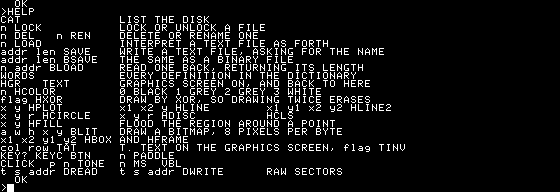

## Precompiled overlays

Compiling a library from source costs a dictionary search per token.  The
same library saved as an image of the dictionary it produced loads at disk
speed:

```forth
MARK                    \ before defining anything
: FOO ... ;  : BAR ... ;
SAVEDICT                \ writes a binary file, asking for a name
```

and in a later session, before anything else is defined:

```forth
n LOADDICT              \ the words are simply there
```

Nothing is relocated, because the image goes back at the address it came
from. That is the whole trick and also the whole limitation: a thread cell is
an absolute address, so moving one word would mean patching every thread that
names it. `LOADDICT` refuses the load rather than landing somewhere else, and
the two cells `MARK` lays down are what it checks. `UNMARK` throws away
everything since the mark, which is what makes the round trip testable in one
session.

## Memory map

| range | what |
|---|---|
| `$0400-$07FF` | the text screen, in **both** banks — even columns in aux, odd in main |
| `$0800-$0CFF` | sector buffers: raw sector, VTOC, track/sector list, disk nibbles |
| `$0D00-$0FFF` | one sector of boot source while booting; scratch and `PAD` after |
| `$1000-$186F` | the parsed catalog, 36 bytes per file |
| `$1870-$1FFF` | every buffer that would otherwise ship as zeros in the image — hash buckets, flood seed stacks, line buffers, disk decode table, float stack (the whole map is in `src/kernel.inc`) |
| `$2000-$3FFF` | hi-res page 1 — in **both** banks; aux and main interleave byte by byte to make 560 pixels per row |
| `$4000-$7FB5` | the kernel |
| `$7FB6-$BFFF` | the user's dictionary, growing upward — 16,458 bytes |
| `$D000-$FD3F` | the system's own dictionary, in the language card |
| `$FFFA-$FFFF` | the CPU vectors, copied there from ROM |

The kernel and the dictionary share one 32K region, so moving something from
one to the other gains nothing — the only wins are code that is smaller or
RAM that is somewhere else.

The big one was the system's own source. `system.fth` used to be assembled
into the image as a byte table: **nearly ten kilobytes of text**, read
exactly once at cold start and then dead weight for the rest of the session,
in the same 32K the dictionary had to grow into. It now lives on the disk at
fixed sectors and the kernel streams it a sector at a time into `$0D00` — see
[Streaming the source](#streaming-the-source). That is worth 9.9K.

Everything past `$186F` — `CATBUF` is page-aligned but only sixty records
deep — is a block of RAM the kernel image doesn't have to carry. The fill's
seed stacks and the line buffers went there first; the hash buckets, the
disk decode table, the numeric output buffer and the floating point stack
followed, which is what brought `PICSAVE` back from 412 bytes short. One
warning, learned the expensive way: **the map of that region lives in
`src/kernel.inc` and nowhere else.** When two files each allocated from it
independently, the decode table landed on the flood fill's seed stack, and a
flood fill would have quietly destroyed every disk read until the next boot
— while the whole test suite stayed green, because no test happened to fill
and then read.

**A fresh boot now leaves 16,458 bytes free.** The system's dictionary in
the language card is the scarcer resource these days: it reaches `$FD3F` of
a `$FFF9` ceiling, so about 700 bytes remain for the system to grow into.

Zero page: `$00-$4F` is left alone — the monitor's text window state and the
80-column firmware's own variables live there, and the console calls both on
every line typed. `$50-$DF` was Applesoft's, and Forth replaces Applesoft, so
it is all ours. The data stack occupies `$50-$9F` and **`$A0-$AF` is a
deliberate gap** — the deepest primitive reaches `7,X`, so an empty-stack
fetch lands in the gap rather than on `IP`. Without it, `@` on an empty stack
stores its result *into* `IP` and the inner interpreter jumps somewhere
random: a mistyped line has to produce an error, not a crash.

## Streaming the source

The kernel does not contain `system.fth`. It contains a routine that reads
it, a sector at a time, from fixed tracks the filesystem is not allowed to
touch.

`tools/mkboot.py` packs the source into 256-byte sectors with **no line
crossing a boundary**, so the reader never has to hold a partial one: a zero
byte means this sector is finished. `tools/mkdisk.py` lays them from track 8,
consecutively — a sector takes about a second to compile and the disk turns
five times in that, so spacing them out would buy nothing.

`Refill` already preferred a source pointer to the keyboard. All that changed
is what happens when that source runs out: instead of dropping to the
keyboard it reads the next sector, and only drops to the keyboard when there
are none left.

Three things had to be got right, and none was:

- **The tracks have to be reserved before the filesystem is filled**, not
  after. DOS puts a file wherever the VTOC says is free, and it said tracks
  8-10 were free, so laying the source there wrote over three files that
  were already on the disk. `mkdisk.py --reserve` now runs immediately after
  the disk is formatted.
- **How many tracks to reserve has to be asked, not assumed.** The count was
  a constant — tracks 0-10 — and the source grew past it: 70 sectors is
  tracks 8 to *12*. Tracks 11 and 12 stayed marked free, the filesystem put
  files on them, and the source was then laid straight over those files.
  Nothing complained. The catalog still gave the file its full length, the
  sectors still read back cleanly, and what came off them was a piece of
  `system.fth` — so a file simply turned into something else somewhere in
  its middle. `GFXLIB.FTH` was one of the two that landed there. Both the
  reserving pass and the laying pass now call one function to work the
  number out, and laying refuses if the VTOC disagrees with it. The same
  question on the machine is the `SRCEND` word, which `INIT` uses.
- **`mkdisk.py` took the interleave from `argv[4]` only when there were
  exactly five arguments.** Adding a sixth silently dropped the kernel to
  interleave 3 while the boot loader still read it at 5, which loads a
  kernel made of the right sectors in the wrong order — and that boots far
  enough to be confusing.

## Boot cost

About 18 emulated seconds, nearly all of it compiling `system.fth`. The
history is worth recording, because two of the three attempts at this were
aimed at the wrong thing:

- **Indexing the dictionary** cut compiling from ~28s to ~11s. `FindWord` was
  a linear scan of a linked list that reached ~210 entries, and the kernel
  primitives are defined first, so every lookup of `+` or `@` walked the whole
  chain. It is now hashed into 16 buckets on the first character and length.
- **Bypassing DOS's file manager** to load the kernel produced no measurable
  gain, because loading was never the cost.
- **Dropping DOS entirely** — a boot sector that pulls the kernel off track 0
  with the system's own Disk II driver — took ~24s off the front, because a
  DOS boot cost the same whether it then ran a 2-sector binary or a 15K one.
  It also handed back the 10K DOS occupied at `$9600-$BFFF`.

Removing the windowing environment took the image from 23233 bytes to 15577
and the boot from ~28 emulated seconds to ~18. Filling the language back out
to 310 words put it at 24145 bytes and ~31 seconds — the extra time is
compiling the Forth half of the word set, not loading it.

`make gui SPEED=8` boots in about two seconds.

## Testing

`make test` types Forth at the console and checks **machine state**, not the
screen: a screenshot tells you something changed, the data stack tells you
what the system believes. `X` is the stack pointer and the top level parks it
in `XSAV` before waiting for a line, so while the prompt is up the whole stack
can be read out of zero page.

```bash
make test                # everything: 118 cases, ~7 minutes
make test T="arith xor"  # named tests
python3 tools/contest.py --list
```

The suite runs **headless** (`-video none -sound none`). It reads memory
rather than the screen, so a window would only steal focus once per test.

Three things about the harness were worth more than they cost:

- **`natkeyboard:post` types over many frames.** Guessing how long put every
  assertion a line behind; `natkeyboard.is_posting` says when it is done.
- **Readiness waits for a variable, not a frame count.** `NFREE` is filled by
  the greeting, so a non-zero `NFREE` means the console is up — and growing
  the image no longer moves the finish line.
- **An ioport field does not stay written.** Anything driving the game port
  has to reassert it every frame, or an input lands or is missed depending on
  which frame it fell on.
- **A step that touches the disk needs to be waited for.** Sampling the stack
  forty frames after a line was typed catches a word that seeks the head
  half-finished, and a half-finished word looks exactly like a wrong one. A
  flood fill needs longer still.
- **Reading a graphics address from the test harness only sees main memory.**
  Even byte columns are in aux, so a check aimed at one reads zero however
  well the drawing worked. Scan a wide range, or aim at an odd column.
- **Scratch addresses in the tests must be below the kernel.** `$0D00-$0FFF`
  is the only RAM the system leaves alone. Anything above `$4000` is kernel
  or dictionary and moves as the system grows, which is how a working test
  started failing.
- **Asserting on state tells you *that* a case failed, never *why*.** The
  console had usually said why — `NAME?`, `NO SUCH FILE`, `DISK ERROR` — and
  none of it was visible. The `screen` step prints the 80-column text back as
  text, and found a disk-layout bug in one run that a stack assertion had
  only ever reported as a wrong number. The switch is `PAGE2`, not `RAMRD`:
  with 80STORE on — which is how the console runs — RAMRD is ignored for
  `$0400-$07FF`, so reading through it gives main memory twice and a screen
  of doubled letters.
- **The count at the bottom does not say where to look.** A full run is
  thousands of lines; `contest.py` prints the failing case *names* after it.

## The language card

Sixteen kilobytes of RAM at `$D000-$FFFF`, which is also where the monitor
ROM lives. **The system's own dictionary is compiled into it**, and the
dictionary pointer comes back to main memory when the boot source has been
read — so none of the system is in the user's way. They get the whole of
`KERNEL_END` to `$BFFF`, contiguous.

The card is banked in for the life of the session. That works because
everything below `$C000` is untouched by the switch: main code and data stay
visible either way, and only the ROM disappears. There were exactly **twelve
places that called into it**, and each is bracketed by a pair of switches —
which is what made this affordable.

Three things had to be dealt with:

- **The CPU takes its reset and interrupt vectors from `$FFFA-$FFFF`**
  whatever is banked there. Those six bytes are copied out of the ROM at cold
  start, reading ROM and writing the card at the same time — which is exactly
  what `$C089` is for.
- **The card has to be write-enabled, not just readable.** `$C088` reads the
  card but write-protects it, so the dictionary compiled into nothing and the
  boot hung after the banner. `$C08B`, twice, is the one that does both.
- **`GETLN` is in the ROM**, so waiting for a line meant waiting with the card
  banked out — with the dictionary invisible for as long as the prompt sat
  there. `ReadLine` replaces it: it waits in main memory and steps into the
  ROM only for the few cycles it takes to echo a character.

Compiling the system into the card rather than letting the dictionary run
across the `$C000` hole means no definition can ever straddle it, which is
the failure that arrangement would invite.

**A fresh boot now leaves 18,205 bytes** — with 4.6K still spare in the card.

## Known issues

- **Nothing checks for dictionary overflow.** If `HERE` runs past `$BFFF` it
  walks into the I/O page, and writing there throws soft switches.
- **`tools/words.lua` shows only odd columns.** The console keeps even
  columns in auxiliary memory and the script reads main.

## Debugging

Four scripts, all driven the same way: `SDL_VIDEODRIVER=dummy` and
`-video none` together, or MAME opens a window and takes over a Space. One
without the other is not enough — `-video none` alone still opens a window on
macOS, and the dummy driver alone fails to initialise OpenGL.

**`tools/words.lua`** prints every name in the live dictionary. `WORDS` on the
machine scrolls past faster than it can be read; this walks the definition
chain in memory instead and prints the lot on one line, with a star on the
immediate ones. It is what the coverage check in this repository runs on.

```bash
LATESTV=$(printf '%d' 0x$(awk '/\.LATESTV$/{print $2}' build/forth.lbl)) \
SDL_VIDEODRIVER=dummy mame apple2ee -rompath ./roms -sl4 "" \
  -flop1 build/forth.dsk -skip_gameinfo -video none -sound none \
  -nothrottle -seconds_to_run 55 -autoboot_delay 0 \
  -autoboot_script tools/words.lua
```

**`tools/contest.lua`** is the test harness, and the right tool for one-off
poking too: it types a line, waits for the machine to finish it, and reads
machine state rather than the screen. `-autoboot_command` types at a fixed
rate, and the Apple II keyboard has no buffer — a new keypress overwrites the
last — so anything typed while Forth is busy is **silently lost**, which looks
exactly like a logic bug. Use `python3 tools/contest.py --list` and add a case
rather than driving MAME by hand.

**`tools/pc.lua`** samples the program counter once a frame and prints the
tail, which is how you find out where a hang is. **`tools/profile.lua`** does
the same over a range and counts, for finding where the boot time goes. Map
the addresses back with `build/forth.lbl`.

Reading characters off a screenshot is guesswork, and worse here than usual:
the console keeps its even columns in auxiliary memory, so anything reading
`$0400-$07FF` from main sees every other character.

## Running it

```bash
make gui     # a window, at real speed, for using the machine
make run     # headless: boots, screenshots, exits
make test    # headless: 273 assertions, about two minutes
```

**Only `make gui` puts anything on the display.** `run` and `test` are
automated — they have nothing to show anyone while they work, and a window
that steals a Space every forty seconds makes the machine unusable while a
suite runs. Going headless takes both halves of the incantation:
`-video none` on its own still opens a window on macOS, and
`SDL_VIDEODRIVER=dummy` on its own fails to start OpenGL. MAME will still
take a snapshot in that state, which is what makes `make run` useful and how
every image in `docs/` was captured.

## The built disks

`dist/2eforthos.dsk` is a bootable 140K DOS-order image, committed so the
system can be run without cc65 or a2kit: it boots to the Forth prompt in
about thirty seconds. `dist/programs.dsk` is the Programs disk beside it —
the examples, the games, and the free space — for drive 2.

**You still need the ROMs.** Apple's are not ours to redistribute and are not
in this repository — `make roms` rebuilds the set from AppleWin and apple2js,
verifying every CRC against what MAME expects. Without them MAME cannot find
the //e firmware or the Disk II controller and drops the machine to the
monitor prompt, which looks like the image being broken and is not.

```bash
make roms                                  # once: rebuild roms/ from source
cd ~/2eforthos
mame apple2ee -rompath ./roms -sl4 "" -flop1 dist/2eforthos.dsk \
  -flop2 dist/programs.dsk
```

`-rompath` is the part people miss, and `-sl4 ""` empties a slot whose
default card wants a ROM we do not have. `make gui` passes both for you,
which is the easier way to run it from a clone of this repository.

The image is refreshed by `make dist` rather than by every build, so it
changes when someone means it to. `build/` stays scratch and stays ignored.

```bash
make dist       # rebuild the shipped image from source
```

## Build system

```
src/system.fth ─mkboot.py─┐
roms/…341-0036.chr ─mkfont.py─┤
                              ├→ ca65 → ld65 → forth.bin → a2kit → .dsk → MAME
src/*.s src/*.inc ────────────┘
```

The disk carries **its own boot sector** on track 0, the kernel on the tracks
after it, and a DOS 3.3 filesystem holding `SYSTEM.FTH` (the OS's own source)
and a few text files — so `CAT` has a real catalog to list. There is no DOS
and no Applesoft greeting: the boot PROM loads `boot/boot1.s`, which reads the
kernel with the same Disk II driver the system uses afterwards.

| knob | default | meaning |
|---|---|---|
| `PROG` | `forth` | output binary/disk name |
| `MACHINE` | `apple2ee` | MAME driver (`apple2p` still builds for the ][+ tests) |
| `MONITOR` | `4` | MAME monitor type — 4 is B&W, 0 is colour |
| `SRCDIR` | `src` | which directory to assemble |
| `ORG` | `0x4000` | load address |
| `SECS` | `32` | emulated seconds before auto-exit (boot needs ~18) |

```bash
make run                                          # the Forth system
make run PROG=hirestest SRCDIR=test               # the driver test
make run PROG=hello SRCDIR=examples ORG=0x0800    # hello world
```

`make run` boots unthrottled (~15x) and exits after `SECS` emulated seconds,
dropping a PNG in `shots/`. Emulation is deterministic, so unthrottling
changes only wall-clock pacing. `make gui` runs at true 1 MHz for interactive
work.

### Conventions

- **Entry point goes in `.segment "STARTUP"`**, which links first so it lands
  exactly at `ORG` regardless of how many source files there are.
- **High ASCII.** The text screen wants the high bit set: `'H'` is `$C8`.

### Disk

`make disk` produces a bootable image: own boot sector, kernel, and a DOS 3.3
filesystem for the files. It is a standard DOS-order `.dsk`, so it also runs
in other emulators or on real hardware via ADTPro. Inspect the filesystem
side with `a2kit catalog -d build/forth.dsk`.

## Emulator

MAME's `apple2ee` driver (enhanced Apple //e). MAME already makes the
Extended 80-column card the default aux device, so 128K and double hi-res are
standard — no extra ROM for either. MAME ships no Apple ROMs and **neither
does this repository** — they are not ours to redistribute. Rebuild them:

```bash
make roms
```

Everything downloaded is CRC-checked against what MAME expects, and the script
refuses to finish on a mismatch:

- **AppleWin** carries the //e main ROMs (as one 16K image) and the mousetext
  character generator, plus the ][+ system ROMs and the Disk II boot PROM.
- **apple2js** carries the Disk II logic-state sequencer, transcribed from
  *Understanding the Apple IIe* rather than dumped. It indexes the table by
  (state, input); the physical PROM wires those bits to its address lines in
  a different order, so the script searches all 8! orderings for the one whose
  CRC matches. Same data, re-addressed.

### The keyboard ROM

One file is **generated, not downloaded**: `341-0132-d.e12`, the //e keyboard
decoder. No open project ships that dump — GitHub turns up only references to
it, including MAME's own source and Mednafen's documentation listing its
SHA-256. With a blank stand-in the machine boots perfectly and the keyboard is
completely dead.

It does not have to be Apple's dump, though, because MAME uses it as a plain
lookup (`apple2e.cpp`, `ay3600_data_ready_w`):

```
address = key << 2 | !shift | !ctrl << 1 | !capslock << 9
ascii   = kbdrom[address]
```

with `key = row * 10 + column` (`kb3600.cpp`). `tools/mkkbdrom.py` builds a
table that decodes correctly from the published North American //e matrix.

A detail that cost a debugging round: the matrix must follow MAME's **`PORT_CHAR`
assignments**, not the ASCII-art comment above them — the two disagree about
N and M, and the ports are what MAME actually scans. Get it wrong and keys
come out as their neighbours.

MAME prints a checksum warning for this file on startup. That is cosmetic; the
keyboard works. Drop a real dump over the top and the warning goes away.

Check the result independently with:

```bash
mame -rompath ./roms -verifyroms apple2p    # the ][+ set is complete
mame -rompath ./roms -verifyroms apple2ee   # warns on the generated keyboard
```

The other ROM reported missing is `sc01a.bin`, the Votrax speech chip on the
Mockingboard in slot 4, which `-sl4 ""` removes.

### Monochrome

Double hi-res is a colour mode by default, and one-pixel strokes fringe badly.
MAME's per-machine **Monitor type** config selects B&W; `make monitor` writes
that setting into `cfg/$(MACHINE).cfg` before every run, which is what makes
560×192 read as 560 monochrome pixels. Override with `MONITOR=0` for colour.

| tool | role |
|---|---|
| `ca65` / `ld65` (cc65) | 6502 assembler and linker |
| `a2kit` | disk images, file import, Applesoft tokenising |
| `mame` | the Apple ][+ itself |
