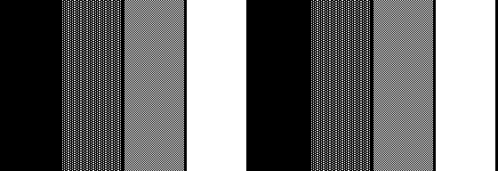
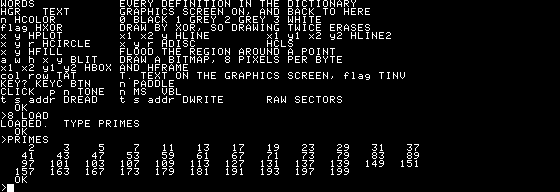
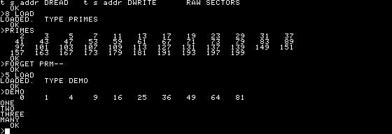
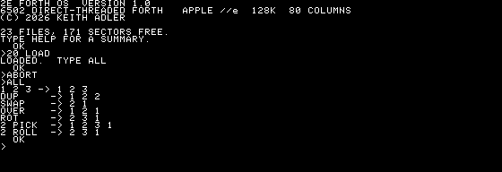
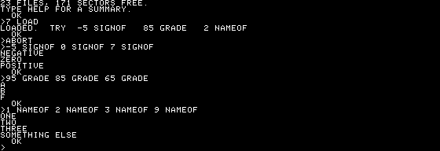
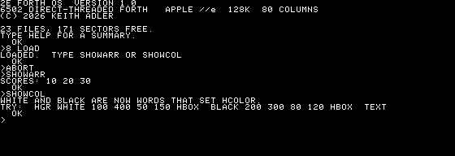
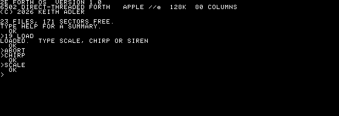
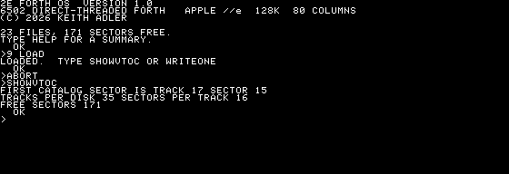
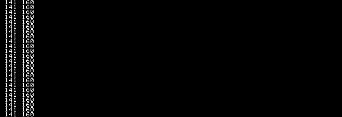

# The demos

Six programs on the disk, in Forth, each small enough to fit in the
dictionary the system leaves free. `CAT` lists them with the number `LOAD`
wants:


Load one, run it, and give the space back before loading the next:

```
CAT             find the number
10 LOAD         load it
GFX             what the demo said to type
TEXT            back to the console, for the graphics ones
FORGET GFX--    reclaim the dictionary
```

The numbers move as files are added to the disk, so `CAT` first rather than
trusting one written down here.

Each demo defines a marker as its first word for exactly that. There is only
about 1.1K of dictionary free on a fresh boot, so one demo at a time.

**Loading uses the graphics screen as its buffer.** That is why the graphics
demos define words and print an instruction rather than drawing something
immediately: turning the screen on while the file is still being read would
overwrite what was left of it.

---

## GFX

`examples/GFX.FTH` — `CAT` for its number, then `n LOAD`, then `GFX`.

Everything the drawing words do, on one screen: an outlined box flooded
from a point inside it, four concentric circles, eight filled bars, a
sprite, and a line of text on the graphics screen.

The flood is the slow part — it fills by scanlines, but the scanning either
side of each run is per pixel, so a region this size takes a few seconds.


<details>
<summary>GFX.FTH</summary>

```forth
\ GFX.FTH -- shapes, flood fill and a sprite.
\
\ Type GFX to draw it, TEXT to come back to the console, and
\ FORGET GFX-- to give the dictionary space back.
: GFX-- ;
CREATE STAR $18 C, $3C C, $7E C, $FF C, $7E C, $3C C, $18 C,
: RINGS 4 0 DO 280 96 20 I 20 * + HCIRCLE LOOP ;
: BARS 8 0 DO I 60 * 20 + DUP 40 + 165 180 HBOX LOOP ;
: GFX HGR HCLS 3 HCOLOR
  40 200 20 80 HFRAME
  120 50 HFILL
  RINGS BARS
  STAR 8 7 500 20 BLIT
  2 1 TAT T." 2E FORTH OS  GRAPHICS" ;
." LOADED.  TYPE GFX" CR
```

</details>

---

## MOIRE

`examples/MOIRE.FTH` — `CAT` for its number, then `n LOAD`, then `MOIRE`.

Two fans of lines drawn in XOR mode. Where a line from one centre crosses
a line from the other the two cancel, so what is left is the pattern the
crossings make rather than the lines themselves. This is the sort of thing
560 by 192 with one bit per pixel is actually good at.


<details>
<summary>MOIRE.FTH</summary>

```forth
\ MOIRE.FTH -- interference patterns, and the dither colours.
\
\ Two fans of lines drawn in XOR mode: where a line from one centre crosses
\ a line from the other, the two cancel, and what is left is the pattern the
\ crossings make rather than the lines themselves.
\
\ Type MOIRE or BANDS.  FORGET MOI-- to reclaim the space.
: MOI-- ;
: FAN ( cx cy -- )
  560 0 DO 2DUP I 0 HLINE2  2DUP I 191 HLINE2  12 +LOOP 2DROP ;
: MOIRE HGR HCLS 3 HCOLOR -1 HXOR
  180 96 FAN  380 96 FAN
  0 HXOR ;
: BANDS HGR HCLS
  8 0 DO I HCOLOR  I 70 * DUP 66 +  0 191 HBOX LOOP
  3 HCOLOR 0 24 TAT ;
." LOADED.  TYPE MOIRE OR BANDS" CR
```

</details>

---

## BANDS

`examples/MOIRE.FTH` — `CAT` for its number, then `n LOAD`, then `BANDS`.

The same file's other word: the eight values `HCOLOR` takes, side by side.
0 is black and 3 is white; the six between them are dither patterns, and
the dither alternates along both axes — otherwise a 50% pattern comes out
as vertical stripes instead of grey.



---

## BOUNCE

`examples/BOUNCE.FTH` — `CAT` for its number, then `n LOAD`, then `BOUNCE`.

A sprite bouncing around the screen, caught mid-flight. In XOR mode a
shape drawn twice in the same place leaves the screen as it was found, so
nothing needs saving and no rectangle needs clearing — the loop is draw,
move, draw. `VBL` paces it off the video counter. Any key stops it.


<details>
<summary>BOUNCE.FTH</summary>

```forth
\ BOUNCE.FTH -- an animated sprite, erased by drawing it again.
\
\ In XOR mode a shape drawn twice in the same place leaves the screen as it
\ was found, so no background needs saving and no rectangle needs clearing.
\ VBL waits for the video counter, which paces the whole thing off the same
\ crystal that drives the display.
\
\ Type BOUNCE.  Any key stops it.  FORGET BNC-- to reclaim the space.
: BNC-- ;
CREATE BALL
  $3C C, $7E C, $FF C, $FF C, $FF C, $FF C, $7E C, $3C C,
VARIABLE BX VARIABLE BY VARIABLE DX VARIABLE DY
: SHOW BALL 8 8 BX @ BY @ BLIT ;
: STEP
  BX @ DX @ + BX !  BY @ DY @ + BY !
  BX @ 0< IF 0 BX ! DX @ NEGATE DX ! THEN
  BX @ 551 > IF 551 BX ! DX @ NEGATE DX ! THEN
  BY @ 0< IF 0 BY ! DY @ NEGATE DY ! THEN
  BY @ 183 > IF 183 BY ! DY @ NEGATE DY ! THEN ;
: BOUNCE HGR HCLS 3 HCOLOR -1 HXOR
  0 BX ! 0 BY ! 7 DX ! 3 DY !
  SHOW
  2000 0 DO SHOW STEP SHOW VBL KEY? IF LEAVE THEN LOOP
  0 HXOR KEY? IF KEYC DROP THEN ;
." LOADED.  TYPE BOUNCE" CR
```

</details>

---

## PRIMES

`examples/PRIMES.FTH` — `CAT` for its number, then `n LOAD`, then `PRIMES`.

Trial division by odd numbers only, stopping once the divisor squared
passes the candidate, printed in columns with `.R`. Loops, early `EXIT`
from inside a `BEGIN`, and right-justified output.



<details>
<summary>PRIMES.FTH</summary>

```forth
\ PRIMES.FTH -- loops, and numbers in columns.
\
\ Trial division by odd numbers only, stopping once the divisor squared
\ passes the candidate.  Type PRIMES.  FORGET PRM-- to reclaim the space.
: PRM-- ;
: PRIME? ( n -- flag )
  DUP 2 < IF DROP 0 EXIT THEN
  DUP 2 = IF DROP -1 EXIT THEN
  DUP 1 AND 0= IF DROP 0 EXIT THEN
  3
  BEGIN 2DUP DUP * 1- > WHILE
    2DUP MOD 0= IF 2DROP 0 EXIT THEN
    2 +
  REPEAT
  2DROP -1 ;
: PRIMES 0 200 2 DO
    I PRIME? IF I 5 .R 1+ DUP 12 MOD 0= IF CR THEN THEN
  LOOP DROP CR ;
." LOADED.  TYPE PRIMES" CR
```

</details>

---

## DEMO

`examples/LANG.FTH` — `CAT` for its number, then `n LOAD`, then `DEMO`.

`ARRAY` is a word that makes words — `CREATE` lays down the space and
`DOES>` says what the words it made should do when they run. Then `CASE`,
which is itself built out of `POSTPONE` and the `IF`/`ELSE`/`THEN` the
compiler already had.



<details>
<summary>LANG.FTH</summary>

```forth
\ LANG.FTH -- making new defining words, and CASE.
\
\ ARRAY is a word that makes words: CREATE lays down the space and DOES>
\ says what the words it made should do when they run.
\
\ Type DEMO.  FORGET LNG-- to reclaim the space.
: LNG-- ;
: ARRAY CREATE CELLS ALLOT DOES> SWAP CELLS + ;
10 ARRAY SQUARES
: FILLSQ 10 0 DO I DUP * I SQUARES ! LOOP ;
: SHOWSQ 10 0 DO I SQUARES @ 5 .R LOOP CR ;
: NAME ( n -- ) CASE
    1 OF ." ONE" ENDOF
    2 OF ." TWO" ENDOF
    3 OF ." THREE" ENDOF
    ." MANY"
  ENDCASE CR ;
: DEMO FILLSQ SHOWSQ 1 NAME 2 NAME 3 NAME 9 NAME ;
." LOADED.  TYPE DEMO" CR
```

</details>

---

## The rest of the examples

`examples/` also holds a tutorial set, walked through in
[TUTORIAL.md](TUTORIAL.md), each heavily commented:

| file | |
|---|---|
| `HELLO.FTH` | printing, a first definition, both comment forms |
| `STACK.FTH` | the stack words, each shown with `.S` |
| `MATH.FTH` | floored division, and why `*/` exists |
| `LOOPS.FTH` | `DO` `?DO` `+LOOP` `LEAVE` `J`, and the loop that always runs once |
| `CONDS.FTH` | `IF`/`ELSE`/`THEN`, and `CASE` as library code |
| `DEFINING.FTH` | `CREATE ... DOES>` — words that make words |
| `STRINGS.FTH` | `S"` `COUNT` `TYPE`, and pictured numeric output |
| `COMMENTS.FTH` | what the two comment forms will and will not swallow |
| `PADDLE.FTH` | the game port, and plotting what it says |
| `DISKIO.FTH` | raw sectors, and writing a file |

**Looking at things.** `SEE` decompiles a word back to something you can read,
and prints inline literals as numbers rather than mistaking them for whatever
word happens to live at that address. `DUMP` shows memory. `MARKER` makes a
word that forgets everything defined after it, itself included.


Every one of them, on the machine:

**`STACK.FTH`** — `ALL` shows what each stack word does to `1 2 3`, printed by
`.S`, which is the word to reach for first when something is not doing what
you expected.



**`CONDS.FTH`** — `IF`/`ELSE`/`THEN` nested three deep, then the same thing
written with `CASE`. `CASE` is not built in: it is four lines of Forth in
`SYSTEM.FTH`, made out of `IF` and `ELSE` and `POSTPONE`.



**`DEFINING.FTH`** — `ARRAY` is a word that makes array words, and `COLOUR`
makes `WHITE` and `BLACK` into words that set the drawing colour. This is the
part of Forth with no equivalent in most languages.



**`SOUND.FTH`** — nothing to see but the prompt coming back, which is the
point: `TONE` sits in a delay loop for the whole note, because there is no
timer to hand it off to.



**`DISKIO.FTH`** — `SHOWVTOC` reads track 17 sector 0 and reports what the
volume table of contents says about the disk it is running from.



**`PADDLE.FTH`** — the game port, scaled to screen coordinates with `*/`
because 17 × 255 does not fit in a cell.



**`POINTER.FTH`** — the loadable framework: a press becomes an `EV-DOWN` at
the right coordinates, a move becomes an `EV-MOVE`, and `HOT-FIND` returns the
execution token for whatever region the point falls in.


## Writing your own

Type it, save it, load it back:

```forth
S" : HELLO 1234 ;" SAVE
```

A quoted string ends at the first `"`, so a one-liner typed this way cannot
itself contain one — which is the other reason to write anything real as a
file on the host.

`SAVE` asks for a name. `CAT` will show it, and `n LOAD` reads it back and
defines `HELLO`. For anything longer than one line, write the file on the
host and put it in `disk/` — `make disk` picks up everything there.

A demo file should:

- define a marker first, so `FORGET` can reclaim the whole thing;
- define words and *print* what to type, rather than running graphics at
  load time, because loading is using the graphics screen as its buffer;
- stay under about a kilobyte of dictionary.
