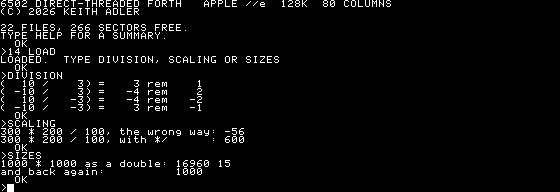
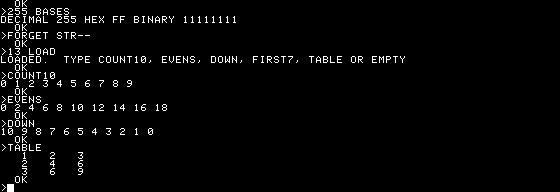
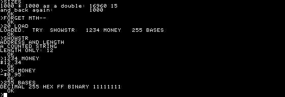

# Writing programs on this machine

From the prompt to a program saved on the floppy. If you have never used a
Forth, read [FORTH.md](FORTH.md) first — it is short, and it explains why
any of this is shaped the way it is.

Everything below is on the disk as an example file, heavily commented. `CAT`
lists them and `n LOAD` reads one in.

---

## 1. The prompt

Boot the disk and you get a `>`.


Type something and press return:

```
2 3 + .
```

It prints `5`. Three things happened: `2` and `3` pushed themselves onto the
stack, `+` took two off and put their sum back, and `.` took that off and
printed it.

This is the whole model. Values go on a stack; words take them off and put
things back. There is no expression syntax because there are no expressions.

If you type something the system does not know, it echoes it with a `?` and
abandons the line. Nothing is broken; try again.

## 2. Seeing the stack

`.S` prints the stack without disturbing it, deepest on the left:

```
1 2 3 .S
```

> `1 2 3`

Use it constantly. Almost every mistake in Forth is a stack that does not
contain what you thought it did, and `.S` is how you find out. `DEPTH` gives
the count if you want it as a number.

The stack survives from line to line, so you can build something up over
several lines and inspect it as you go. `ABORT` empties it.

**Example file:** `STACK.FTH` — the stack words, each shown with `.S`.

## 3. Defining a word

```
: SQUARE DUP * ;
```

`:` takes the next word as a name and starts compiling; `;` ends it. Nothing
between them ran — they were compiled into `SQUARE`. Now:

```
7 SQUARE .
```

> `49`

A definition can use anything defined before it. That is the only ordering
rule in the language, and it comes from the dictionary being a list searched
backwards from the newest.

Keep words short. The Forth habit is to write a word as soon as a phrase
appears twice, and to name it after what it means rather than what it does.
A definition longer than a few lines is usually two words that have not been
separated yet.

**Example file:** `HELLO.FTH` — printing and a first definition.

## 4. Comments

Two forms, both ordinary words, so both need a space after them:

```forth
\ from a backslash to the end of the line
( from a bracket to the closing one, over as many lines as it takes )
```

The convention worth adopting is the **stack comment**, written just inside a
definition:

```forth
: SCALE ( n num den -- n' ) */ ;
```

Nothing checks it. It is still the most useful thing you can write, because a
word's entire interface is what it takes off the stack and what it leaves.

**Example file:** `COMMENTS.FTH`.

## 5. Numbers

Arithmetic is `+ - * / MOD /MOD ABS NEGATE MIN MAX`, and two things will
catch you out.

**Division is floored.** The quotient rounds toward negative infinity and the
remainder takes the sign of the divisor:



`SM/REM` truncates toward zero if that is what you need.

**A cell is sixteen bits.** `300 200 * 100 /` overflows and gives −56.
`300 200 100 */` keeps a 32-bit intermediate and gives 600. Any time you are
scaling — a coordinate, a fraction, a percentage — `*/` is the word.

`BASE` sets the number base for both input and output, and every word that
prints a number honours it:

```
16 BASE !  255 .        \ FF
2 BASE !   255 .        \ 11111111
10 BASE !
```

A `$` prefix always reads hex whatever `BASE` says, which is why `$C030`
means what it looks like.

**Example file:** `MATH.FTH`.

## 6. Choosing and repeating

```forth
: SIGNOF ( n -- )
  DUP 0< IF ." NEGATIVE" ELSE ." NOT NEGATIVE" THEN DROP CR ;
```

`IF` consumes a flag. `THEN` means "and then carry on", not "do this" — it
is the closing bracket, not the body.

Loops count from a start to a limit, with the limit given first:

```forth
: COUNT10 10 0 DO I . LOOP CR ;
```



**The trap:** `DO` always runs its body at least once, so `0 0 DO` counts all
the way round to 65536. Use `?DO` for anything that might be empty. `+LOOP`
steps by any amount in either direction, `LEAVE` jumps out, and `J` gets the
index of the next loop out.

**Example files:** `CONDS.FTH`, `LOOPS.FTH`.

## 7. Storing things

```forth
VARIABLE COUNTER
0 COUNTER !          \ store
COUNTER @ .          \ fetch
1 COUNTER +!         \ add to it
```

`CONSTANT` is the same shape without the storage: `10 CONSTANT ROWS`.

`CREATE NAME` makes a word that pushes an address, and whatever you `,` or
`ALLOT` after it belongs to that word. That is how you get an array — and
how you get a *kind* of array:

```forth
: ARRAY ( n -- ) CREATE CELLS ALLOT DOES> ( i -- addr ) SWAP CELLS + ;
5 ARRAY SCORES
10 0 SCORES !
0 SCORES @ .
```

`ARRAY` is a word that makes words. Everything before `DOES>` happens once,
when `SCORES` is defined. Everything after it happens every time `SCORES`
runs, and is handed the address `CREATE` set aside.

This is the part of Forth with no equivalent elsewhere, and it is worth
spending time on: it is how the language grows toward your problem instead of
your program growing away from the language.

**Example file:** `DEFINING.FTH`.

## 8. Text

```forth
S" HELLO" TYPE          \ an address and a length
." HELLO"               \ print directly
```

For numbers in a particular shape, pictured output builds the string a digit
at a time, backwards — which is the order division produces them in:

```forth
: MONEY ( n -- )
  DUP ABS 0 <# # # [CHAR] . HOLD #S [CHAR] $ HOLD ROT SIGN #> TYPE CR ;
1234 MONEY
```

> `$12.34`



Because digits are held backwards, the last thing you `HOLD` is the first
thing printed — which is why the sign goes after the dollar sign, not before
it.

**Example file:** `STRINGS.FTH`.

## 9. Drawing

The graphics screen is a thing the language turns on:

```forth
HGR HCLS 3 HCOLOR
100 400 50 150 HFRAME
250 100 HFILL
280 96 40 HCIRCLE
TEXT
```

`HXOR` makes every drawing word exclusive-or what it draws, so drawing the
same shape twice leaves the screen as it was found. That is how you animate
without saving any background:

```forth
: MOVEIT -1 HXOR  BALL 8 8 X @ Y @ BLIT
  10 X +!  BALL 8 8 X @ Y @ BLIT  0 HXOR ;
```

Full list in [LANGUAGE.md](LANGUAGE.md#the-graphics-screen); the drawn
results are in [DEMOS.md](DEMOS.md).

**Example files:** `GFX.FTH`, `MOIRE.FTH`, `BOUNCE.FTH`, `PADDLE.FTH`.

## 10. Saving it

A one-liner can go straight to the disk:

```forth
S" : HELLO 1234 . CR ;" SAVE
```

`SAVE` asks for a name. `CAT` will show it, and `n LOAD` reads it back and
defines `HELLO`. That is the whole round trip, and it works — but a quoted
string ends at the first closing quote, so anything longer wants to be a
file.

For a real program, write it on the host, put it in `examples/`, and
`make disk`. Everything in that directory goes on the floppy.

A file should:

- **define a marker first** — `: MYPROG-- ;` — so `FORGET MYPROG--` gives
  the whole thing back;
- **define words and print what to type**, rather than doing anything at
  load time. Loading uses the graphics screen as its buffer, so a file that
  calls `HGR` while it is still being read overwrites the rest of itself;
- **stay under about a kilobyte** of dictionary.

**Example file:** `DISKIO.FTH`.

## 11. How much room you have

This is the real constraint, and it is worth knowing before you plan
anything.

```
$BF00 HERE - .
```

About **1100 bytes** on a fresh boot. The kernel and the dictionary share one
32K region, so there is no wardrobe to move things into — the language
itself is what fills the machine.

What that means in practice:

- One example loaded at a time. `FORGET` before loading the next.
- A program of ten or fifteen short definitions is comfortable. Fifty is not.
- Nothing checks for overflow. If the dictionary runs past `$BFFF` it walks
  into the I/O page, and writing there throws soft switches. Keep an eye on
  `HERE`.

If you want more, the language card's 16K is the place it would come from,
and nothing has been done about it yet.

## 12. When something goes wrong

| | |
|---|---|
| `.S` | what is actually on the stack |
| `WORDS` | every definition, newest first |
| `HERE` | how much room you have used |
| `FORGET NAME` | throw away `NAME` and everything after it |
| `ABORT` | empty the stack and start again |
| `PAGE` | clear the screen |

The two mistakes that account for most of it: a word that leaves something on
the stack it should have consumed, and a definition that refers to a word
defined *after* it. `.S` finds the first. The second announces itself with a
`?` at compile time.

---

## Where to go next

- [LANGUAGE.md](LANGUAGE.md) — every word, with stack effects
- [DEMOS.md](DEMOS.md) — the six graphical demos, with screenshots
- [FORTH.md](FORTH.md) — the language's history, and why it is like this
- Leo Brodie, *Starting Forth* and *Thinking Forth* — the second one is
  about how to factor a program into words, and is the better book
